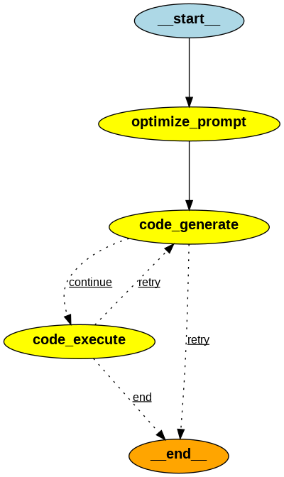

# RACA-I: ReAct Code Agent

**RACA-I** (ReAct Code Agent) is an advanced AI-powered Python code generation agent that transforms natural language instructions into executable code. Built with OpenAI 04-mini and the LangGraph framework, it provides a secure, interactive web interface for rapid prototyping, code generation, execution of generated code in secure environment, and answering questions requiring calculations, data analysis, and more.

---

## 🚀 Features

- **Natural Language Coding:** Describe what you want to build, and RACA-I generates Python code for you.
- **Instant Execution:** Run generated code securely in an isolated environment and get immediate results.
- **Retry & Robustness:** Built-in retry logic for code generation and execution.
- **Downloadable Output:** Download generated code with a single click.
- **Modern Web UI:** Clean, user-friendly interface powered by [Gradio](https://gradio.app/).
- **Custom Examples:** Predefined and custom examples to guide your prompts.
- **Powered by OpenAI & LangGraph:** Utilizes state-of-the-art cost-effective OpenAI's [o4-mini](https://platform.openai.com/docs/models/o4-mini) model for powering AI agent and getting reliable results.
- **Secure Execution:** Your code is generated and executed in an isolated, sandboxed environment provided by [E2B](https://e2b.dev/).

---

## 📊 Agent Workflow Visualization



## 🖥️ Demo

URL to video with demo will be available soon.

---

## 📦 Installation

### Prerequisites

- [Docker](https://www.docker.com/) & [Docker Compose](https://docs.docker.com/compose/)
- OpenAI API key (for OpenAI's [o4-mini](https://platform.openai.com/docs/models/o4-mini) access)
- [E2B](https://e2b.dev/) API key (for secure code execution)

#### To Start the App in YOUR local environment

```bash
git clone https://github.com/EdwardMaievskyi/RACA-I.git
cd */RACA-I  # Navigate to the project directory
cp .env.example .env  # Copy the example .env file and edit it with your OpenAI API key
pip install -r requirements.txt  # Install dependencies
chmod +x run.sh  # Make run.sh file executable
./run.sh  # Run the app
```

By default, the app runs at: [http://localhost:7860](http://localhost:7860)

#### To Stop and View Logs

```bash
docker-compose down    # Stop the app
docker-compose logs -f # View logs
```

---

## 🛠️ Manual Installation (Dev Mode)

1. **Clone the repo and set up environment variables:**
   ```bash
   git clone https://github.com/EdwardMaievskyi/RACA-I.git
   cd RACA-I
   cp .env.example .env
   # Edit .env with your OpenAI API key
   ```

2. **Install dependencies:**
   ```bash
   pip install -r requirements.txt
   ```

3. **Run the Gradio app:**
   ```bash
   python ui/gradio_app.py
   ```

---

## 💡 Usage

1. Start the app (see above).
2. In the browser, describe your coding task in natural language (e.g., "Create a password generator with customizable length and character sets").
3. Click **"Generate & Execute Code"** to get results, or **"Generate Code Only"** to preview without execution.
4. Download the code or review the output as needed.

### Example Prompts

- `Calculate the 101st Fibonacci number`"],`
- `Calculate the 97th prime number`
- `Return a plain text table with the historical prices of the BTC-USD ticker for the last 20 days from Yahoo Finance`
- `Create a password generator with customizable length and character sets`
- `Return current weather conditions for the following cities: Vancouver (BC), Kyiv (UA), Washington(DC), San Francisco(CA), in the format of a plain text table using the Open-Meteo API.`
- `Convert 20 Fahrenheit to Celsius`
- `Count number of characters 'r' in the word 'raspberry'`

---

## 🧩 Architecture Overview

- **UI Layer:** `ui/gradio_app.py` manages the Gradio web interface, user input, and result display.
- **Core Agent Logic:** The `core/` directory contains the code generation, code execution, and workflow graph logic (`core/graph_flow.py`, `core/code_agent.py`, etc.).
- **Workflow Engine:** Uses LangGraph to manage prompt optimization, code generation, execution, and retry logic as a directed graph. Used ReAct Code agent architecture was recreated from scratch.
- **Security:** All code execution is isolated in a Docker container by non-root user.

---

## ⚙️ Configuration

- `.env` file for OpenAI API, E2B API keys and runtime settings.
- Customizable retry attempts and other UI settings.

---

## 📝 License

This project is licensed under the **GNU Affero General Public License v3.0**. See the [LICENSE](LICENSE) file for details.

---

## 🤝 Contributing

Pull requests, issues, and feature requests are welcome! Please open an issue to discuss your ideas or report bugs.

---

## 📫 Contact

- Author: Eduard Maievskyi
- GitHub: [EdwardMaievskyi](https://github.com/EdwardMaievskyi)
- LinkedIn: [EduardMaievskyi](https://www.linkedin.com/in/eduard-maievskyi-phd/)
- For questions, please contact via GitHub or LinkedIn or open an issue.
